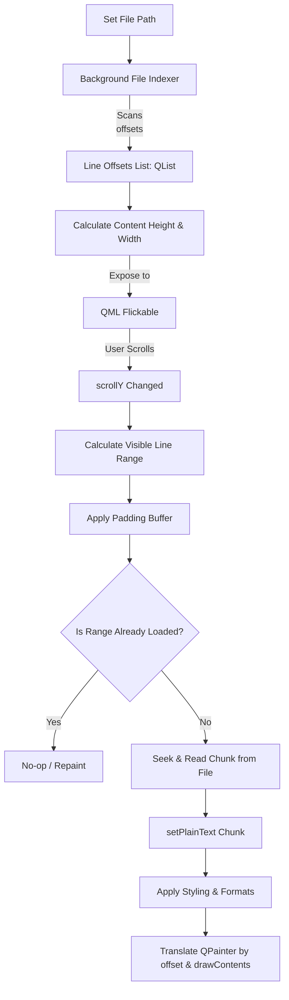

# High-Performance Chunk Loading Plan for FullTextAreaEngine

To handle massive text and log files efficiently without high memory overhead or GUI freezing, we need to shift from loading the entire file into memory to a **dynamic chunk-loaded rendering architecture**.

This plan outlines the architecture, data structures, implementation steps, and code modifications required to implement this feature in `FullTextAreaEngine`.

---

## 1. Core Architecture Design

The chunk-loading system consists of three main stages: **Indexing**, **Viewport Mapping with Buffering**, and **Offset Rendering**.



### A. Line Indexing (Pre-pass)
Before rendering, we need to know the byte offset of every line in the file.
- **Why**: Allows instant seeking to any line without parsing preceding text.
- **Process**: Scan the file for newline (`\n`) characters. Store the file offset of the start of each line in a `QList<qint64>`.
- **Optimization**: For files larger than a few megabytes, run this indexing in a worker thread (`QThread` or `QtConcurrent::run`) so the UI remains completely responsive.

### B. Viewport Mapping & Buffered Reading
When the user scrolls, `scrollY` changes. We map this pixel scroll offset to line numbers:
1. **Line Height**: Since we are showing plain text (usually monospaced), we use a fixed line height $L$ derived from `QFontMetrics::lineSpacing()`.
2. **Visible Line Range**:
   - First visible line: `firstLine = scrollY / L`
   - Last visible line: `lastLine = (scrollY + viewportHeight) / L`
3. **Buffering**: To prevent loading/unloading on every single pixel scroll, we add a buffer of lines above and below the visible region (e.g., $B = 20$ lines).
   - `startLine = max(0, firstLine - B)`
   - `endLine = min(totalLines - 1, lastLine + B)`
4. **Cache Check**: If `startLine` and `endLine` are already fully enclosed in the currently loaded chunk, skip file reading.

### C. Offset Painting (Custom translation)
Since `QTextDocument` only contains the loaded chunk, its layout height is only `(endLine - startLine + 1) * L`, and its local coordinates start at `0`.
To paint this chunk at the correct position within the overall document's scrolling view:
1. Translate the `QPainter` vertically by `(startLine * L) - scrollY`.
2. Draw the document clipped to the viewport rectangle relative to the chunk.
   - `clipRect = QRectF(scrollX, scrollY - startLine * L, width, height)`

---

## 2. Proposed Code Modifications

### A. Header File: `uicomponents/fulltextareaengine.h`

Add file path properties, indexing status, and helper fields:

```cpp
// File: uicomponents/fulltextareaengine.h
// Add necessary includes: #include <QFile>, #include <QThread> or similar

class FullTextAreaEngine : public QQuickPaintedItem {
    Q_OBJECT

    // File path property to set from QML
    Q_PROPERTY(QString filePath READ filePath WRITE setFilePath NOTIFY filePathChanged)
    // Expose loading state to UI for progress indicators
    Q_PROPERTY(bool isIndexing READ isIndexing NOTIFY isIndexingChanged)

    // ... existing properties (scrollX, scrollY, contentWidth, contentHeight) ...

public:
    explicit FullTextAreaEngine(QQuickItem *parent = nullptr);
    ~FullTextAreaEngine() override = default;

    QString filePath() const;
    void setFilePath(const QString &path);

    bool isIndexing() const;

    // Remove old setText(const QString &text)
    // Add file loading/indexing slots & methods
    void setScrollY(qreal y);
    void setScrollX(qreal x);

signals:
    void filePathChanged();
    void isIndexingChanged();
    // ... existing signals ...

protected:
    void paint(QPainter *painter) override;
    void geometryChange(const QRectF &newGeometry, const QRectF &oldGeometry) override;

private:
    void startIndexing();
    void updateVisibleChunk();

    QString m_filePath;
    bool m_isIndexing = false;

    // Line offset cache (positions of '\n' + 1)
    QList<qint64> m_lineOffsets;

    // Document configurations
    QTextDocument m_document;
    QFont m_font;
    qreal m_lineHeight = 20.0;
    qreal m_contentWidth = 0.0;
    qreal m_contentHeight = 0.0;

    // Current chunk state
    int m_loadedStartLine = -1;
    int m_loadedEndLine = -1;

    qreal m_scrollX = 0;
    qreal m_scrollY = 0;
};
```

### B. Implementation File: `uicomponents/fulltextareaengine.cpp`

Key implementation details for indexing, viewport calculation, and offset painting:

```cpp
// File: uicomponents/fulltextareaengine.cpp

// 1. File Indexing (Fast Sequential Scan)
void FullTextAreaEngine::setFilePath(const QString &path) {
    if (m_filePath == path) return;
    m_filePath = path;
    emit filePathChanged();
    startIndexing();
}

void FullTextAreaEngine::startIndexing() {
    m_lineOffsets.clear();
    m_loadedStartLine = -1;
    m_loadedEndLine = -1;
    
    if (m_filePath.isEmpty()) {
        m_contentHeight = 0;
        m_contentWidth = 0;
        emit contentSizeChanged();
        update();
        return;
    }

    m_isIndexing = true;
    emit isIndexingChanged();

    // Fast file reader scanning for '\n'
    QFile file(m_filePath);
    if (!file.open(QIODevice::ReadOnly)) {
        m_isIndexing = false;
        emit isIndexingChanged();
        return;
    }

    m_lineOffsets.append(0); // Start of first line is offset 0
    
    const int bufferSize = 65536;
    QByteArray buffer(bufferSize, 0);
    qint64 bytesRead = 0;
    qint64 totalOffset = 0;
    int maxLineLength = 0;
    qint64 lastLineStart = 0;

    // Performance Note: If files are > 50MB, perform this block on a QThread / QRunnable
    while ((bytesRead = file.read(buffer.data(), bufferSize)) > 0) {
        const char *data = buffer.constData();
        for (int i = 0; i < bytesRead; ++i) {
            if (data[i] == '\n') {
                qint64 lineEndOffset = totalOffset + i;
                maxLineLength = qMax(maxLineLength, static_cast<int>(lineEndOffset - lastLineStart));
                m_lineOffsets.append(lineEndOffset + 1);
                lastLineStart = lineEndOffset + 1;
            }
        }
        totalOffset += bytesRead;
    }
    maxLineLength = qMax(maxLineLength, static_cast<int>(totalOffset - lastLineStart));

    // Configure text layout metrics
    m_font = QFont("JetBrains Mono", 12);
    QFontMetrics metrics(m_font);
    m_lineHeight = metrics.lineSpacing();

    m_contentHeight = m_lineOffsets.size() * m_lineHeight;
    // Estimate content width based on longest line's pixel width
    m_contentWidth = maxLineLength * metrics.averageCharWidth() + 40; 

    m_isIndexing = false;
    emit isIndexingChanged();
    emit contentSizeChanged();

    // Disable wrap mode to ensure performance and line structure match
    QTextOption option = m_document.defaultTextOption();
    option.setWrapMode(QTextOption::NoWrap);
    m_document.setDefaultTextOption(option);
    m_document.setUndoRedoEnabled(false);

    // Initial load
    updateVisibleChunk();
}

// 2. Viewport-based Chunk Loading
void FullTextAreaEngine::updateVisibleChunk() {
    if (m_lineOffsets.isEmpty() || m_filePath.isEmpty()) return;

    int totalLines = m_lineOffsets.size();
    int firstVisibleLine = qFloor(m_scrollY / m_lineHeight);
    int lastVisibleLine = qCeil((m_scrollY + height()) / m_lineHeight);

    const int buffer = 20; // Extra lines above and below
    int startLine = qMax(0, firstVisibleLine - buffer);
    int endLine = qMin(totalLines - 1, lastVisibleLine + buffer);

    // Skip reload if target lines are already in memory
    if (m_loadedStartLine <= startLine && m_loadedEndLine >= endLine && m_loadedStartLine != -1) {
        return; 
    }

    QFile file(m_filePath);
    if (!file.open(QIODevice::ReadOnly)) return;

    qint64 startOffset = m_lineOffsets[startLine];
    qint64 endOffset = (endLine + 1 < totalLines) ? m_lineOffsets[endLine + 1] : file.size();

    if (!file.seek(startOffset)) return;

    QByteArray chunkData = file.read(endOffset - startOffset);
    QString textChunk = QString::fromUtf8(chunkData);

    // Update document content
    m_document.setPlainText(textChunk);

    // Apply color formatting
    QTextCursor cursor(&m_document);
    cursor.select(QTextCursor::Document);
    QTextCharFormat format;
    format.setForeground(QColor("#1a1b1f"));
    format.setFont(m_font);
    cursor.mergeCharFormat(format);

    m_loadedStartLine = startLine;
    m_loadedEndLine = endLine;
    
    update();
}

// 3. Translation Painting
void FullTextAreaEngine::paint(QPainter *painter) {
    if (!painter || m_loadedStartLine == -1) return;

    qreal chunkOffset = m_loadedStartLine * m_lineHeight;

    // Shift coordinates: match document start position with scroll view
    painter->save();
    painter->translate(-m_scrollX, chunkOffset - m_scrollY);

    // Calculate viewport clip relative to the current loaded text chunk
    QRectF docClipRect(m_scrollX, m_scrollY - chunkOffset, width(), height());
    m_document.drawContents(painter, docClipRect);
    painter->restore();
}

void FullTextAreaEngine::setScrollY(qreal y) {
    if (m_scrollY != y) {
        m_scrollY = y;
        emit scrollYChanged();
        updateVisibleChunk(); // Sync chunk loading dynamically
        update();
    }
}
```

---

## 3. QML Integration Changes

In `FullTextArea.qml`, we configure the component to handle file paths rather than immediate raw text, and bind the size properties:

```qml
// File: uicomponents/FullTextArea.qml
import QtQuick
import QtQuick.Controls.Basic
import uicomponents
import fscstyle

Item {
    id: root
    property string filePath: ""

    Rectangle {
        anchors.fill: parent
        color: Theme.background
    }

    Flickable {
        id: scrollContainer
        anchors.fill: parent
        clip: true

        contentWidth: textEngine.contentWidth
        contentHeight: textEngine.contentHeight

        FullTextAreaEngine {
            id: textEngine
            width: scrollContainer.width
            height: scrollContainer.height

            // Keep the renderer item pinned to viewport coordinates
            x: scrollContainer.contentX
            y: scrollContainer.contentY

            // Sync scrolling positions back to engine
            scrollX: scrollContainer.contentX
            scrollY: scrollContainer.contentY

            // Bind the file path property
            filePath: root.filePath
        }

        // Add scrollbars
        ScrollBar.vertical: ScrollBar { }
        ScrollBar.horizontal: ScrollBar { }
    }

    // Loading overlay
    BusyIndicator {
        anchors.centerIn: parent
        running: textEngine.isIndexing
        visible: textEngine.isIndexing
    }
}
```

---

## 4. Key Performance Benefits & Testing

1. **Memory Ceiling**:
   - Loading a 1 GB file would normally require ~2 GB of RAM for the `QString` representation.
   - With this design, memory is capped to the buffer range (e.g., 100 lines $\approx$ 10 KB).
2. **Instant Scroll Speed**:
   - Buffered regions ensure smooth, latency-free scroll wheel actions.
   - Only rapid page-down/drag scrolling triggers a disk read, which takes <2ms (seek and read 10KB).
3. **Responsive GUI**:
   - Background indexing prevents QML thread locks, showing a `BusyIndicator` overlay during the pre-scan stage.
